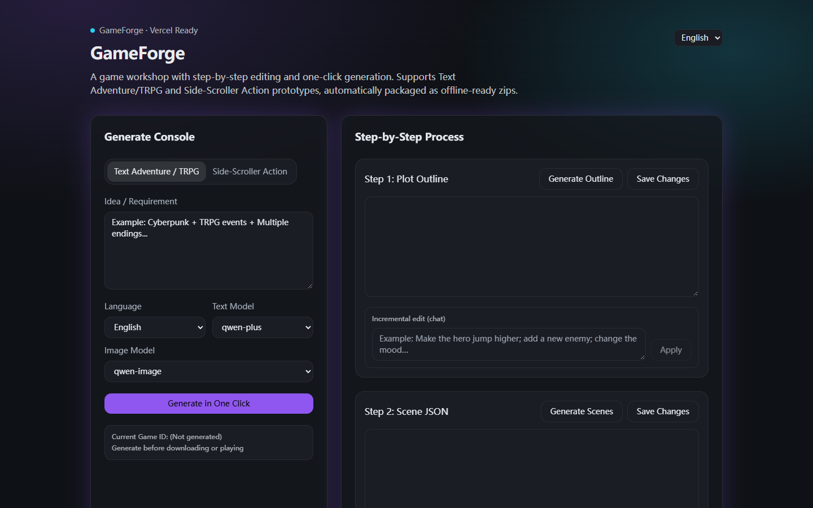
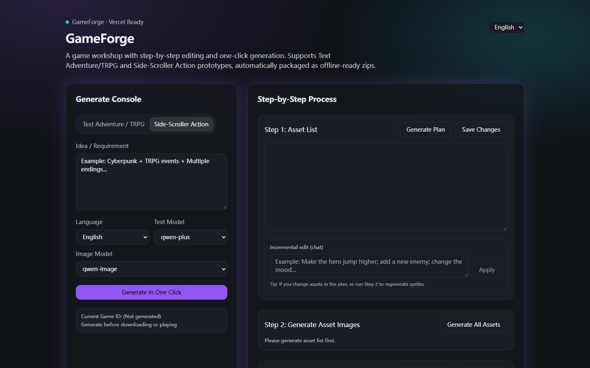
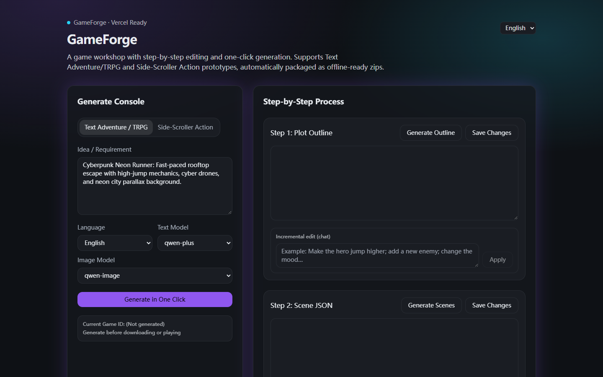
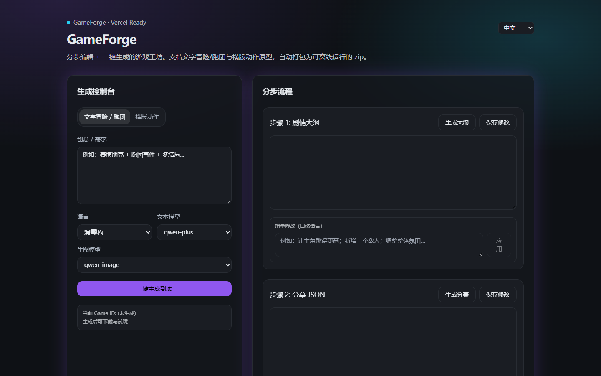

# GameForge

<div align="center">

**AI-Powered Game Workshop: Step-by-Step Editing & One-Click Generation**  
*Generate playable Text Adventure / TRPG and Side-Scroller Action prototypes, automatically packaged as offline-ready ZIP builds.*

[Live Demo](http://1.14.46.26/GameForge) • [Key Highlights](#key-capabilities--highlights) • [UI & Workflow Showcase](#ui--workflow-showcase) • [Game Pipelines](#supported-game-pipelines) • [Architecture](#technical-architecture) • [API Reference](#api-endpoints) • [Local Development](#local-development--deployment) • [Production Insights](#engineering-insights)

</div>

---

## Overview

**GameForge** is a full-stack generative AI game workshop built with **Next.js (App Router)**, **Gemini API**, **Phaser 3**, and **Sharp**. It closes the gap between creative ideation and functional gameplay by turning a natural-language concept into an immediately playable browser game within minutes.

Unlike static narrative tools or isolated image generators, GameForge coordinates the entire game development lifecycle—from structured JSON schema synthesis (plot outlines, scene graphs, and asset manifests) to multimodal sprite rendering, automatic green-screen chroma keying, dynamic game engine wiring, and offline packaging. Creators can execute the pipeline end-to-end with a single click or inspect and refine each intermediate stage using structured JSON editors and natural-language incremental adjustments.

<div align="center">
  
  <p><em>Figure 1: GameForge Generation Console and Step-by-Step Editing Pipeline</em></p>
</div>

---

## Key Capabilities & Highlights

- 🎮 **Dual Game Archetypes**: Generates interactive **Text Adventure / TRPG** narratives with branching choices as well as playable **Side-Scroller Action** prototypes powered by Phaser 3.
- ⚡ **Flexible Execution Modes**: Supports both automated **One-Click Generation** for rapid prototyping and **Step-by-Step Editing** for granular human-in-the-loop control.
- 🎨 **Identity-Consistent Sprite Pipeline**: Solves character drift by generating an initial canonical front-facing reference sprite (`__front`), followed by image-to-image variant synthesis (run, idle, attack) that strictly preserves palette, costume, and facial identity.
- ✂️ **Automated Chroma Key Cutout**: Features an adaptive two-pass green-screen extraction algorithm powered by Sharp, identifying border hue variations to output clean, transparent PNG sprites ready for game engine ingestion.
- 💬 **Natural-Language Incremental Editing**: Enables fine-tuning at each stage through conversational prompts (e.g., *"Make the protagonist jump higher"*, *"Introduce an aerial drone enemy"*, *"Shift atmospheric tone to rainy cyberpunk"*).
- 📦 **Offline-First Zero-Dependency Export**: Bundles engine runtimes, generated assets, sound routines, and gameplay logic into standalone ZIP packages that run locally in any browser without accounts or servers.
- 🌐 **Full Bilingual Support**: Provides complete internationalization across English and Chinese UI locales.

---

## UI & Workflow Showcase

### 1. Dual Generation Modes

Users select their target game archetype, configure model parameters, and submit their core game theme.

| Text Adventure / TRPG Mode | Side-Scroller Action Mode |
| :---: | :---: |
|  |  |
| **Pipeline**: Step 1: Plot Outline JSON → Step 2: Scene Branching JSON → Step 3: Scene Illustration Generation. | **Pipeline**: Step 1: Asset Manifest JSON → Step 2: Sprite Art & Backgrounds → Step 3: Playable HTML5 Code. |

---

### 2. Natural Language Prompting & Bilingual Localization

The workshop accepts flexible multi-genre prompts and offers responsive localized interfaces.

| Prompt Formulation & Parameter Setup | Chinese Bilingual Interface |
| :---: | :---: |
|  |  |
| **Customization**: Multi-model routing (Gemini 3 Flash, Pro, Qwen), target language selection, and creative seed specifications. | **Localization**: Native next-intl integration providing synchronized terminology across English and Chinese workspaces. |

---

## Supported Game Pipelines

### Pipeline 1: Text Adventure / TRPG

Designed for narrative branching, roleplaying quests, and interactive fiction:

```text
Natural Language Idea
         │
         ▼
[Step 1: Plot Outline JSON] ──► Human / LLM Incremental Edits
         │
         ▼
[Step 2: Scene Graph JSON]  ──► Branching choices, dialogue states, flags
         │
         ▼
[Step 3: Multimodal Scene Art] ──► High-resolution atmospheric illustrations
         │
         ▼
Playable Interactive Web Player + Offline ZIP Download
```

### Pipeline 2: Side-Scroller Action

Designed for arcade platformers, runner prototypes, and action mechanics:

```text
Natural Language Idea
         │
         ▼
[Step 1: Asset Manifest JSON] ──► Character, enemy, platform tiles, UI elements
         │
         ▼
[Step 2: Sprite Generation & Cutout]
    ├── Front Canonical Sprite (`__front`)
    ├── Image-to-Image Action Variants (Run, Jump, Attack)
    └── Adaptive Chroma-Key Processing (Transparent PNGs)
         │
         ▼
[Step 3: Phaser 3 HTML5 Synthesis] ──► Physics, collision, input controls
         │
         ▼
Playable Arcade Canvas + Offline ZIP Download
```

---

## Technical Architecture

```text
┌────────────────────────────────────────────────────────────────────────┐
│                     Next.js 14 Presentation Layer                      │
│   Generation Console │ Step-by-Step Pipeline View │ In-Browser Player  │
└───────────────────────────────────┬────────────────────────────────────┘
                                    │ Server Actions & REST API
┌───────────────────────────────────▼────────────────────────────────────┐
│                    Orchestration & Workflow Engine                     │
│   Schema Validator (Zod) │ Pipeline Controller │ Cache-Bust Dispatcher │
└───────────────────┬────────────────────────────────┬───────────────────┘
                    │                                │
┌───────────────────▼──────────────┐ ┌───────────────▼───────────────────┐
│     Multimodal AI Providers      │ │      Asset Processing Runtime     │
│  • Google Gemini 3 (SDK)         │ │  • Sharp (Adaptive Chroma Key)    │
│  • Text Planning & Code Gen      │ │  • Phaser 3 (HTML5 Engine)        │
│  • Reference & Img2Img Sprites   │ │  • JSZip (Offline Bundler)        │
│  • Optional Cloud Model Routing  │ │  • Vercel KV / Blob / Local FS    │
└──────────────────────────────────┘ └───────────────────────────────────┘
```

---

## API Endpoints

| Endpoint | Method | Purpose |
| :--- | :--- | :--- |
| `/api/generate` | `POST` | Initiates one-click automated generation from end to end |
| `/api/generate-stream` | `GET` | Streams real-time pipeline status events (SSE) to the UI |
| `/api/text/outline` | `POST` | Generates or regenerates the plot outline JSON |
| `/api/text/scenes` | `POST` | Expands plot outline into a branching scene graph |
| `/api/text/images` | `POST` | Generates illustrations for narrative scenes |
| `/api/side/plan` | `POST` | Generates the asset manifest for side-scroller elements |
| `/api/side/images` | `POST` | Generates sprites and executes transparent background cutout |
| `/api/side/game` | `POST` | Synthesizes executable Phaser 3 game code wiring assets |
| `/api/modify/*` | `POST` | Applies natural-language modifications to outlines, plans, or code |
| `/api/export/[id]` | `GET` | Packages and streams a self-contained offline ZIP archive |
| `/api/games/[id]` | `GET` | Fetches game metadata and runtime asset paths |

---

## Local Development & Deployment

### Prerequisites

- Node.js 18+ (Node.js 20+ recommended)
- npm, pnpm, or yarn

### Installation

```bash
# Clone the repository
git clone https://github.com/Karl-XZ/GameForge.git
cd GameForge

# Install dependencies
npm install
```

### Environment Configuration

Create a `.env.local` file in the project root:

```bash
# Primary Gemini API credentials
GEMINI_API_KEY=your_gemini_api_key_here

# Model overrides (optional)
GEMINI_TEXT_MODEL=gemini-3-flash-preview
GEMINI_IMAGE_MODEL=gemini-2.5-flash-image

# Storage options (optional for local file system)
GAMEFORGE_DATA_DIR=./.gameforge-data
```

### Run Development Server

```bash
npm run dev
```

Visit `http://localhost:3000` to open the local generation studio.

### Production Build & Vercel Deployment

For production deployments on Vercel, attach Vercel KV and Vercel Blob storage resources:

```bash
# Build verification
npm run build

# Start production server
npm start
```

Set environment variables in your Vercel project settings:
- `GEMINI_API_KEY`: API access token
- `KV_REST_API_URL` & `KV_REST_API_TOKEN`: Vercel KV persistence
- `BLOB_READ_WRITE_TOKEN`: Vercel Blob media storage

---

## Engineering Insights

1. **Reference-First Asset Generation**: Character consistency requires anchor images. Generating a canonical front pose (`__front`) before generating animation variants via image-to-image ensures unified color palettes, silhouettes, and artistic styles.
2. **Adaptive Chroma Keying**: Real-world generative outputs contain varying hues of green. Sampling border pixels to determine the exact background chroma value followed by a two-pass threshold (strict to relaxed) yields clean sprite boundaries.
3. **Cache-Busting for Deterministic Regeneration**: Web browsers and proxy layers aggressively cache image URLs. Enforcing unique request stamps and nonces on single-asset retries guarantees that regenerated assets immediately reflect user edits.
4. **Structured JSON Validation**: Enforcing Zod schema verification on all LLM outputs prevents downstream pipeline failures, ensuring that game logic and asset keys remain strictly aligned.
